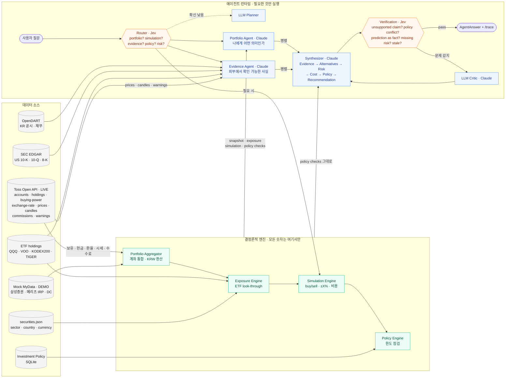

# Personal Investment Intelligence Agent

A multi-agent investment intelligence layer built on top of brokerage and financial APIs.

Instead of predicting asset prices, the system simulates how investment decisions change a user's portfolio.

The architecture separates:

- deterministic financial computation
- fast System-One decision models
- frontier LLM reasoning

> 내 돈을 이해하고, 내가 정한 원칙을 기억하며, 행동하기 전에 결과를 보여주고, 판단의 근거와 불확실성을 설명하는 AI PB.

## What it does

| Experience | Where | How |
|---|---|---|
| **Today for Me** — 오늘 내 돈에 중요한 변화 | `/` | code builds candidate events (price moves, FX, policy proximity, filings, warnings) → deterministic KRW impact → optional Jev relevance → top-N → grounded explanation |
| **Assets** — LIVE / DEMO 계좌 통합 | `/assets` | Toss Open API (LIVE) + Mock MyData (DEMO · MyData), normalized into one `PortfolioSnapshot` |
| **Ask AI PB** + What-if simulation | `/agent` | adaptive multi-agent run streamed over SSE; deterministic simulation panel |
| **Investment Policy** | `/policy` | user-defined limits used as decision constraints; live policy check |
| **Developer Trace** | `/trace/[runId]` | routing scores, agents run / skipped, parallel groups, verification, tokens, cost |

Every investment answer is structured: **Evidence → Alternatives → Risk & Uncertainty → Cost → Investment Policy Check → Recommendation → Limitations**.

## Key technical points

- **Simulation over Prediction** — `POST /api/simulate` applies hypothetical trades and ±X% scenarios (symbol / sector / FX / market) to the real snapshot. No price forecasts.
- **Deterministic Financial Tools** — exposure (ETF look-through), simulation, fees, policy checks are TypeScript; the LLM never produces a number.
- **Calculation Integrity** — one request reuses one snapshot/policy/exposure set; insufficient-cash buys fail instead of creating negative cash; Toss account commission and customer FX buy rate are used when available; KR ETF sells are not charged the stock transaction-tax schedule.
- **Personal Investment Policy** — `singleStockPct`, `sectorPct`, `overseasPct`, `riskyAssetPct`, `minLiquidityPct`, `maxDrawdownPct` checked in code before/after every simulated action.
- **Cross-account Portfolio Aggregation** — `PortfolioProvider` (Toss, Mock MyData) + `MarketDataProvider`; opaque account ids, per-user short TTL cache, no persisted holdings.
- **User Isolation + Multi-turn Memory** — an HttpOnly anonymous session namespaces policy, conversations, caches, tools and traces; the latest 12 compact turns are passed to routing and agents, including deterministic follow-up resolution such as “그중 절반만”.
- **Provider-agnostic Multi-agent Runtime** — Portfolio Agent, Evidence Agent, Synthesizer, LLM Critic on Vercel AI SDK; OpenAI / Anthropic per agent, configured by env or `/api/settings/models`.
- **Jev-based Adaptive Routing** — atomic yes/no questions (`needs_portfolio_data`, `needs_simulation`, …) answered by TypeSafe Jev; the graph is code.
- **Confidence-based LLM Escalation** — routing confidence below `ROUTING_THRESHOLD` escalates to a frontier-LLM planner.
- **Critic-based Verification** — code checks + Jev verification (`unsupported_claim`, `policy_conflict`, `prediction_as_fact`, …); LLM Critic only above `VERIFICATION_THRESHOLD`.
- **Explicit Data Provenance** — every number carries `source / asOf / retrievedAt / isMock`; missing or stale data is surfaced, never filled in.
- **Agent Tracing** — `agent_runs`, `agent_steps`, `tool_calls` in SQLite; latency, tokens, estimated cost, agents avoided.
- **Toss Rate-limit Safety** — account discovery is reused, account-dependent reads are sequenced, and OAuth token refresh is single-flight with one 401 refresh retry.

Runs fully in **demo mode without any API key**: fixture portfolio, rule-based routing, template answers. Add keys to switch on Jev, LLM agents, Toss LIVE data, OpenDART / SEC evidence.

## Architecture: one picture of the multi-agent flow



읽는 법: 회색은 데이터 소스, 초록은 코드 계산, 주황은 System-One 결정, 파랑은 LLM. 숫자는 초록 상자에서만 만들어지고 LLM은 해석·설명만 합니다. 단순 질문("내가 제일 많이 가진 종목은?")은 Router → Portfolio Agent → 답변으로 끝나며 Evidence Agent, Synthesizer, Critic은 *agents avoided*로 trace에 남습니다.

### Agent → 판단 소스 매핑

| 구성요소 | 종류 | 무엇을 판단하나 | 판단에 쓰는 소스 |
|---|---|---|---|
| **Router** | Jev / JEFF (LLM fallback) | 5개 atomic 질문: portfolio · simulation · evidence · policy · risk 필요 여부, 예측 요청 여부 | 사용자 메시지 + 파싱된 종목/거래/시나리오 (`src/orchestration/router.ts`) |
| **LLM Planner** | Claude structured output | Router 확신이 낮을 때만 같은 5개 질문 | Router와 동일 state |
| **Portfolio Aggregator** | code | 연결 자산 하나의 `PortfolioSnapshot` | **Toss Open API** `/accounts` `/holdings` `/buying-power` `/exchange-rate` `/prices` (LIVE), Mock MyData (DEMO) |
| **Exposure Engine** | code | 종목·섹터·국가·통화 실질 노출 (ETF look-through) | snapshot + ETF holdings 스냅샷 + securities.json |
| **Simulation Engine** | code | 매수/매도·시나리오 전후 비중, 비용, 영향액 | metrics + FX + 수수료율(**Toss** `/commissions` 또는 정적 스케줄) |
| **Policy Engine** | code | 원칙 위반/근접 판정 | Investment Policy (SQLite) + before/after metrics |
| **Portfolio Agent** | Claude | "나에게 어떤 의미인가" 해석, 대안 | 위 엔진 결과가 컨텍스트로 주입 + tools (`getPortfolioSnapshot` `getExposure` `simulateTrade` …) |
| **Evidence Agent** | Claude | "외부에서 확인 가능한 사실", 위험, 확인 못 한 것 | OpenDART(KR), SEC EDGAR(US), ETF holdings, **Toss** `/prices` `/candles` `/stocks/{symbol}/warnings` |
| **Synthesizer** | Claude | 구조화 답변 (Evidence → Alternatives → Risk → Cost → Policy → Recommendation → Limitations) | Portfolio/Evidence 결과 + simulation + policy checks(코드 결과를 그대로 반영) |
| **Verification** | Jev / JEFF + 코드 규칙 | 근거 없는 주장·원칙 충돌·예측 단정·위험 누락·오래된 데이터 | 답변 요약·근거·정책 점검·데이터 기준일 |
| **LLM Critic** | Claude | 검증 점수가 임계값 이상일 때만 문제 지적 → Synthesizer 재작성 | 답변 초안 + 원본 데이터 |
| **Relevance Engine** (Today for Me) | code + Jev | 오늘 내 돈에 중요한 변화 후보·영향액·순위 | snapshot 일간 변동(**Toss** holdings dailyProfitLoss), 환율 변동, 정책 근접, 공시/유의사항 |

### Toss Open API가 쓰이는 곳

| 엔드포인트 | 사용처 |
|---|---|
| `POST /oauth2/token` | client-credentials 토큰 (서버에서만, 클라이언트당 1개) |
| `GET /api/v1/accounts` | 계좌 목록 → opaque id로 변환 (계좌번호는 도메인 밖으로 나가지 않음) |
| `GET /api/v1/holdings` | 보유 종목·평단·현재가·일간 손익 → `Position` |
| `GET /api/v1/buying-power` | KRW/USD 현금 → 투자 가능 금액, 시뮬레이션 현금 차감 |
| `GET /api/v1/exchange-rate` | 매매기준율(평가) · 매수환율(환전 비용) · 전일 대비 변동 |
| `GET /api/v1/prices` | 미보유 종목 시뮬레이션 시세, Evidence Agent 현재가 |
| `GET /api/v1/candles` | Evidence Agent 가격 이력 (추세 설명용, 예측 금지) |
| `GET /api/v1/commissions` | 계좌별 수수료율 → 시뮬레이션 비용 |
| `GET /api/v1/stocks/{symbol}/warnings` | 투자경고·단기과열 등 → Today for Me · Evidence |

`ENABLE_REAL_TOSS=false`면 같은 응답 형태의 `fixtures/toss/*`가 DEMO로 표시되어 흐름 전체가 동일하게 동작합니다.

## Getting started

```bash
npm install
cp .env.example .env      # optional: add OPENAI/ANTHROPIC/TYPESAFE/TOSS/DART/SEC keys
npm run dev               # http://localhost:3000 (DB migrates on first request)
npm test                  # policy / simulation / exposure / normalization / routing / golden evals
```

Docker: `docker compose up --build` (dev) or `docker compose -f docker-compose.prod.yml up -d --build` with `DOMAIN=` set for Caddy HTTPS on a VM with a static IP (register that IP in the Toss Open API allow-list).

## Self-hosted decision model (no Jev API access)

[JEFF](https://github.com/logan-markewich/jeff) serves TypeSafe's `POST /v1/systemone` contract from a local 400M GLiFormer model. Clone it to `~/Desktop/jeff`, run the install steps from its README, then:

```bash
npm run jeff   # float16 + JEFF_PAD_MULTIPLE=128 + warmup on Apple MPS: ~0.3 s per routing call, 12-25 s per 5-question verification
```

and set `DECISION_PROVIDER=jev`, `TYPESAFE_API_KEY=devkey`, `JEV_BASE_URL=http://127.0.0.1:8000` (use the IP: `localhost` resolves slowly inside the Next.js runtime). Calls slower than `JEV_TIMEOUT_MS` (20 s) fall back to rule-based routing and are recorded in the trace.

## Environment

See `.env.example`. Notable flags: `ENABLE_REAL_TOSS` (LIVE Toss via OAuth client credentials), `ENABLE_MOCK_MYDATA`, `ENABLE_EXTERNAL_EVIDENCE`, `ENABLE_AGENT_TRACE`, `DECISION_PROVIDER=jev|llm`, `ROUTING_THRESHOLD`, `VERIFICATION_THRESHOLD`. Model names are never hardcoded.

## Repository

```text
app/            pages + API route handlers (portfolio/snapshot, today, simulate, agent (SSE), policy, settings/models)
src/domain      Zod schemas: portfolio, policy, simulation, evidence, agent, today
src/providers   finance (toss, mock-mydata), market (toss, mock), disclosure (dart, sec), etf, llm registry
src/services    portfolio-aggregator, exposure-engine, simulation-engine, policy-engine, relevance-engine, evidence-service
src/tools       Zod-validated agent tools
src/agents      portfolio, evidence, synthesizer, llm-critic, prompts
src/decision    DecisionModel interface, JevDecisionModel, LLMDecisionModel
src/orchestration router, graph, runner, escalation, orchestrator, tracer
fixtures/       demo data (toss, mydata, market, etf, dart, sec)
tests/          unit + integration + evals/golden.json
```

## Evaluation

`tests/evals/golden.json` holds 30 queries with complete labels for all eight routing outputs. `routing-eval.test.ts` compares adaptive routing with a naive **always-on orchestration baseline** using the same exact-match definition.

| Harness (2026-09-22) | Exact workflow match |
|---|---:|
| Adaptive rule router | **100.0% (30/30)** |
| Always-on baseline | **16.7% (5/30)** |

Reproduce with `npx vitest run tests/evals/routing-eval.test.ts --disableConsoleIntercept --reporter=verbose`. This is a deterministic routing benchmark, not an answer-quality claim. Live-model answer quality, unsupported-claim rate, latency and cost remain a separate eval once provider keys and reviewed answer labels are available.

## Non-goals

No real orders, no auto-trading, no portfolio optimization, no price prediction, no full MyData integration, no tax optimization. The cookie is a POC tenant boundary, not authentication; production must bind the same `userId` boundary to an authenticated subject and a per-user credential vault.
